# Windows Docker Guide for KYBER Dedicated Servers (SWBF2)

Host community servers for **STAR WARS Battlefront II (2017)** using KYBER with Docker on Windows — bypassing common NTFS permission issues (like Activation64.dll errors) by using native Linux volumes.

[](https://www.docker.com/)
[](https://www.microsoft.com/windows)
[](https://kyber.gg/)

> [!TIP]
> **New: Easy Asset Ingestion Script!** 🚀
> We've added a PowerShell tool that automates the complex task of creating Docker volumes and transferring your game files, mods, and plugins with a simple drag-and-drop interface. [Jump to Script Setup](#option-a-use-the-kyber-asset-importer-recommended).

**Quick Links:**

- [🚀 Asset Importer Script](#option-a-use-the-kyber-asset-importer-recommended)
- [Full Guide](#guide-hosting-kyber-dedicated-servers-on-windows-docker--kyber) (below)
- [Official KYBER Docs](https://docs.kyber.gg/g/hosting/dedicated-servers)
- [KYBER Discord](https://discord.gg/kyber) (for support/questions)

## Features / Why This Guide?

- **Automated Ingestion:** New script handles Linux-native volume creation and file syncing for you.
- **Windows Optimized:** Step-by-step setup using Docker Desktop + WSL2.
- **Error Prevention:** Avoids common pitfalls like NTFS mounts and `Activation64.dll` permission errors.
- **Scalable:** Supports mods, plugins, Kyber Module, and multiple server instances.
- **Docker-Compose:** Example configs included (`docker-compose.yml`, `.env` templates)

## Prerequisites (Quick Check)

- Windows 10/11 with Virtualization enabled in BIOS
- Docker Desktop (WSL 2 backend)
- ~180 GB free space temporarily
- KYBER CLI + valid EA/Kyber credentials

---
<br><br>

# Guide: Hosting KYBER Dedicated Servers on Windows (Docker + KYBER)

This guide allows you to host a Kyber V2 dedicated server on Windows using Docker Desktop bypassing NTFS permission issues by utilizing native Linux volumes without manually setting up a full Linux distribution.
<br><br>

## Prerequisites

### 1. Enable System Virtualization

- Ensure **Virtualization** is enabled in your BIOS/UEFI.
  - Restart your PC and repeatedly tap the key to enter BIOS setup (usually Delete, F2, or F10 — watch the boot screen for the hint).
  - Find and turn on the virtualization option (look in Advanced, CPU, or Security menu; it's called Intel VT-x, AMD-V, SVM Mode, or similar — change from Disabled to Enabled).
  - Save & exit (usually F10 → Yes), let it reboot — virtualization is now active (check in Task Manager → Performance tab if you want to confirm).
  - Can't find it? Google "[your motherboard model] enable virtualization"

- Enable **WSL** and **Virtual Machine Platform** via PowerShell (Admin):

    ```powershell
    dism.exe /online /enable-feature /featurename:Microsoft-Windows-Subsystem-Linux /all /norestart
    ```

    ```powershell
    dism.exe /online /enable-feature /featurename:VirtualMachinePlatform /all /norestart
    ```

- Install [Docker Desktop](https://docs.docker.com/desktop/setup/install/windows-install/#install-docker-desktop-on-windows) and ensure it is set to use the **WSL 2 engine**.

<br>

### 2: Storage Preparation (CRITICAL)

Battlefront II requires ~90GB of space. Because this guide uses Docker Volumes to bypass NTFS errors, you may temporarily need ~180GB (90GB for the download + 90GB for the Volume).

### Relocating the Docker Disk Image (Highly Recommended)

By default, Docker Desktop stores its virtual disk (where volumes live) on your C: drive. If your C: drive is small, move the disk image to a larger drive:

1. Open Docker Desktop Settings.
2. Navigate to `Resources` > `Advanced`.
3. Under Disk image location, click `Browse` and select a folder on a secondary drive.
4. Click `Apply`. Docker will move your existing data and volumes to the new location.

<details>
<summary>📸 <b>VIEW SCREENSHOT:</b> <code>How to move disk image location</code> (Click to expand)</summary>

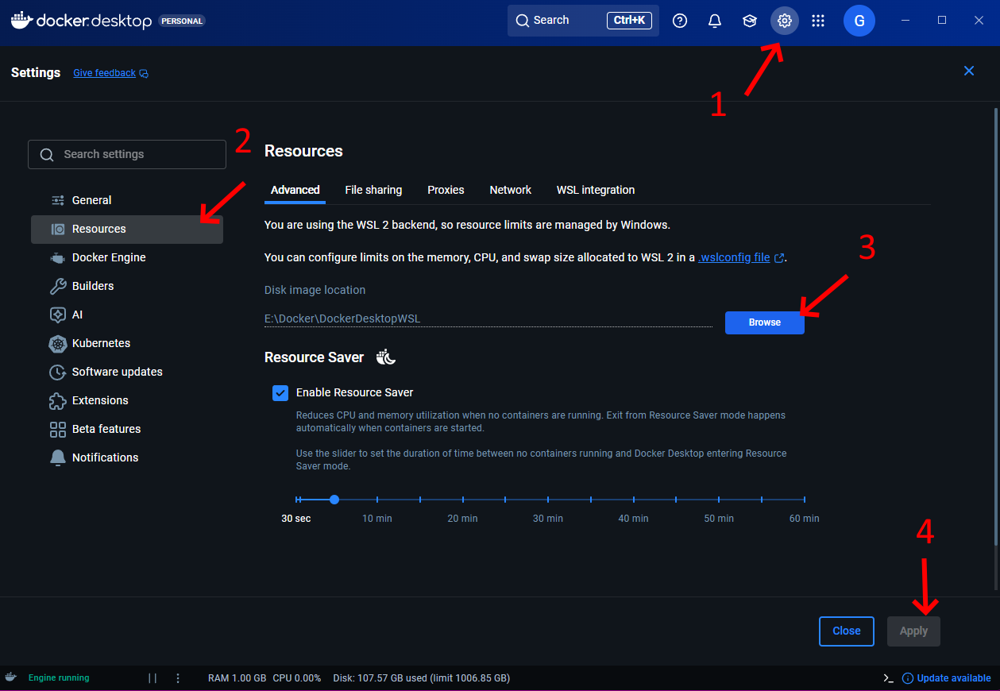
</details>

<br>

### 3. Obtain Kyber Credentials

- Download the **Kyber CLI** from the [Kyber Prerequisites Docs](https://docs.kyber.gg/g/hosting/dedicated-servers/prereq).
- Run the following to link your accounts and generate tokens:
  - `kyber_cli get_token` (Save this token. This will be used later as `KYBER_TOKEN=<token>`)
  - `kyber_cli get_ea_token` (To verify game ownership)

> [!CAUTION]
> **EA PASSWORD SPECIAL CHARACTERS WARNING**
>
> If your EA password contains special characters (!, @, #, $, %, ^, &, *, etc.), your server will likely fail to start.
>
> **Symptoms:** Server hangs or fails at the `start_server` command in logs, even when everything else appears correct.
>
> An error occurred. Please try again later.
> AnyhowException(license request failed: `<?xml version="1.0" encoding="UTF-8" standalone="yes"?> <error code="INVALID_PASSWORD"/>`
>
> **Solution:** Change your EA password to use ONLY:
>
> - Uppercase letters (A-Z)
> - Lowercase letters (a-z)  
> - Numbers (0-9)

<details>
<summary>📸 <b>VIEW SCREENSHOT:</b> <code>How to use kyber_cli</code> (Click to expand)</summary>

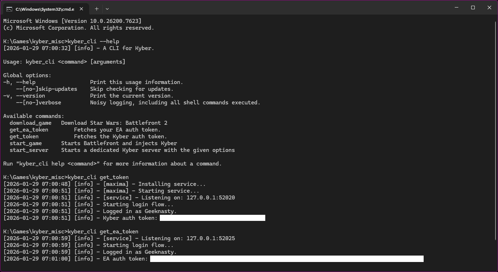
</details>

---

<br><br>

## Step 1: Download Game or Reuse your existing Battlefront II installation

Download the game files using the Kyber_CLI.

1. Run the download:

```bash
kyber_cli download_game -p "C:\Path\To\Game" -t <your_ea_token>
```

2. Once the progress reaches 100%, you can cancel the process.

> **Note:** You may want to change the download path if your `C:\` drive has limited space.

**Alternative: Reuse your existing Battlefront II installation** (Recommended if already downloaded the game and it's unmodified)

If you already have Star Wars Battlefront II installed locally (Steam, EA App/Origin, etc.), you can copy directly from there instead of downloading ~90 GB again. However, any modifications to the game files may negatively effect server hosting. If you're unsure it may be better to download a fresh copy.

1. Locate your game install folder:
   - Steam: Right-click game in library → Manage → Browse local files
   - EA App/Origin: Right-click game → Locate installed files
   Typical paths:
   - `C:\Program Files (x86)\Steam\steamapps\common\STAR WARS Battlefront II`
   - `C:\Program Files\EA Games\STAR WARS Battlefront II`

---
<br><br>

## Step 2: Ingest Game Files, Mods, & Plugins

**The Challenge:** Directly mounting Windows folders into Docker causes **Activation64.dll** errors due to NTFS permission limitations.
**The Solution:** We must move all game files into native Linux Docker Volumes.

### Option A: Use the KYBER Asset Importer (Recommended)

1. **Download the Script:**
   - **Direct Download:** [import-assets.ps1](https://raw.githubusercontent.com/Geeknasty/KYBER-Windows-Hosting-Guide/main/import-assets.ps1) (right-click → Save As)
   - Or clone this repo: `git clone https://github.com/Geeknasty/KYBER-Windows-Hosting-Guide.git`
   - Or [Download all files as ZIP](https://github.com/Geeknasty/KYBER-Windows-Hosting-Guide/archive/refs/heads/main.zip) extract the script.

2. **Run it:**

   > [!IMPORTANT]
   > **Windows 11 Users:** The "Run with PowerShell" option may be hidden. Click "Show more options" at the bottom of the right-click menu to reveal it.

   **Method 1 (Simple):**
   - Right-click the `import-assets.ps1` file
   - Select **Run with PowerShell**
   - **Shortcut:** Hold `Ctrl + Shift` while clicking "Run with PowerShell" to run as administrator

   **Method 2 (If script flashes and closes immediately):**
   1. Search for "PowerShell" in the Start menu
   2. Right-click PowerShell → **Run as administrator**
   3. Navigate to the script folder using `cd` command:
      - Type `cd` followed by a space
      - Copy the folder path from File Explorer's address bar (click the path at the top)
      - Paste into PowerShell (right-click to paste)
      - Press Enter
   4. Run: `PowerShell -ExecutionPolicy Bypass -File ./import-assets.ps1`

   **Method 3 (If you see "execution policy" error):**
   1. Open PowerShell as administrator (see Method 2, steps 1-2)
   2. Navigate to the script folder (see Method 2, step 3)
   3. Run: `PowerShell -ExecutionPolicy Bypass -File ./import-assets.ps1`

> [!NOTE]
> **About Execution Policy Errors:**
> If you see a red error about "running scripts is disabled," this is a Windows security feature. The `-ExecutionPolicy Bypass` command bypasses the restriction for this script only without permanently changing your system settings. This is the safest approach.
>
> **Alternative (Not Recommended):** You can temporarily allow scripts with:
>
> ```powershell
> Set-ExecutionPolicy -ExecutionPolicy RemoteSigned -Scope CurrentUser
> ```
>
> But remember to revert it after running the script for security:
>
> ```powershell
> Set-ExecutionPolicy -ExecutionPolicy Undefined -Scope CurrentUser
> ```

3. **Follow the Prompts:**

   - Select **Option 4** to import your Game Files first.
   - Select **Option 1** for your Mod `.tar` files.
   - Select **Option 2** for your `.kbplugin` files.

> [!TIP]
> **Understanding Docker Volume Names:**
>
> When the script asks for a volume name, **you choose the name yourself**. The script will automatically create the volume if it doesn't exist yet.
>
> **Recommended Naming Convention:**
> Use descriptive names that indicate what's stored inside:
>
> - Game files: `swbf2_gamefiles` or `swbf2_data_vanilla`
> - Mods: `swbf2_mods_hvvchaos` or `swbf2_mods_reinforcement`
> - Plugins: `swbf2_plugins_hvvplayground` or `swbf2_plugins_custom`
> - Kyber Module: `kyber_module_ver10`
>
> **Example workflow:**
>
> ```powershell
> Script: "Enter target volume name:"
> You type: swbf2_gamefiles
> Script: "Volume doesn't exist. Creating swbf2_gamefiles..."
> ```
>
> Later in your `.env` files, you'll reference these exact names. Good naming now saves confusion later!

> [!IMPORTANT]
> **Create an empty_data volume for servers without mods/plugins:**
>
> If you plan to run vanilla servers (no mods or plugins), create an empty volume now:
>
> 1. Open PowerShell
> 2. Run: `docker volume create empty_data`
>
> You'll reference this in your `.env` files later for servers that don't use mods or plugins.

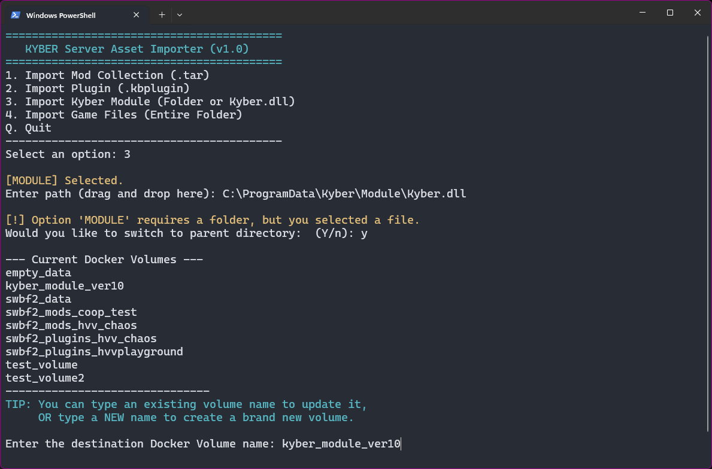

### Option B: Manual Ingestion (Advanced)

If you prefer using the CLI manually, follow these steps:
<details>
<summary>🔍<code> Manual Docker Commands</code>(Click to expand)</summary>

1. **Create the volumes:**

    ```bash
    docker volume create swbf2_data
    docker volume create empty_data
    # Example volume for beta ver/10 kyber-module
    docker volume create kyber_module_ver10 
    ```

    ```bash
    # Create mod/plugin volumes as needed:
    # Example volume for hvv chaos mods
    docker volume create swbf2_mods_hvv_chaos 
    # Example volume for hvvplayground plugin
    docker volume create swbf2_plugin_hvvplayground
    ```

2. **Ingest via Rsync (Game files, Plugins, and Kyber Module):**

    ```bash
    docker run --rm -v "C:\Path\To\Game:/source" -v swbf2_data:/dest alpine sh -c "apk add --no-cache rsync && rsync -ah --info=progress2 /source/ /dest/"
    ```

> **Note:** This may take some time to finish. Depending on the size of data.

  **This works identically for:**

- Game files
- Plugin .kbplugin files (place them in a folder, ingest the folder)
- Kyber Module folder (e.g, `"-v C:\ProgramData\Kyber\Module:/source"`) -> (e.g, `-v kyber_module_ver10:/dest`)

3. **Ingest via Tar (Mods):**

    ```bash
    docker run --rm -v "C:\Path\To\Your\ExportedMods\HVV_CHAOS_MODS.tar:/archive.tar" -v swbf2_mods_hvv_chaos:/dest alpine sh -c "tar -xf /archive.tar -C /dest"
    ```

    >**Note:** This command is different because we need to extract the modcollection.tar into our docker volume.
  
</details>

---
<br><br>

## Step 3: Preparing Mods, Plugins, and Modules

To ingest the game files into our docker volume we just need to select **Option 4** in the **Importer Script** (then wait for the ~90GB to copy). However, for Mods, Plugins, and Modules. Some extra steps required:

### a. Mods

- In the Kyber Launcher: **Options -> Export Collection TAR**.
  <details>
  <summary>📸 <b>VIEW SCREENSHOT:</b> <code>How to export mod collection</code> (Click to expand)</summary>

  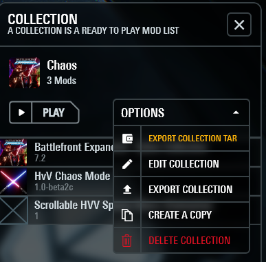
  </details>
- **Run the Importer Script**, select **Option 1**, and drag the `modcollection.tar` file into the window and press enter.
- Target a volume (e.g., `swbf2_mods_hvvchaos`).

### b. Plugins

- Clone [Plugin Examples](https://github.com/ArmchairDevelopers/PluginExamples.git).
- Zip your chosen plugin (ensure `.json` is at the root).
- Rename the file extension from `.zip` to `.kbplugin`.
- Ensure the filename matches the plugin name (e.g., `HVVPlayground.kbplugin`) for consistent loading.
  <details>
  <summary>📸 <b>VIEW SCREENSHOT:</b> <code>How to zip and rename plugins</code> (Click to expand)</summary>

  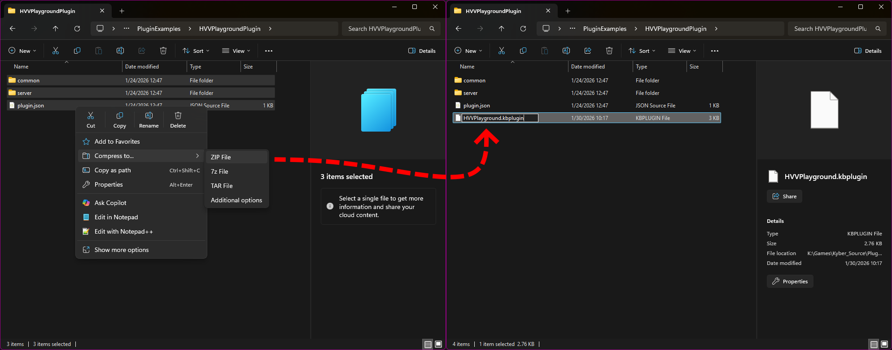
  </details>
- **Run the Importer Script**, select **Option 2**, and drag the `<PluginName>.kbplugin` file into the window
- Target a volume (e.g., `swbf2_plugin_hvvplayground`).

### c. Kyber Module (`Kyber.dll`)

- In Kyber Launcher: **Settings -> Accounts & Updates**.
- Set **Target Service** to `kyber-module` and **Release Channel** to `ver/beta10`.
  <details>
  <summary>📸 <b>VIEW SCREENSHOT: <code>Kyber Launcher Release Channel</code> (Click to expand)</b></summary>
  <br>
  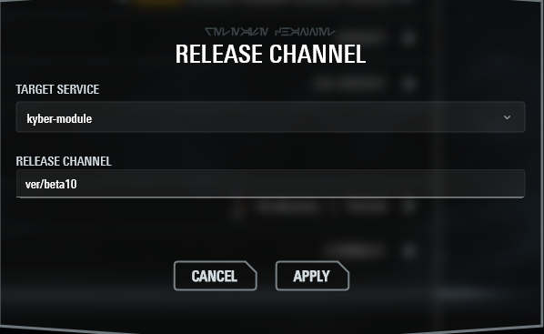
  </details>
- Join any server to trigger the update.
- Locate the files at `C:\ProgramData\Kyber\Module\`.
- **Run the Importer Script**, select **Option 3**, and drag the `Kyber.dll` file into the window.
- The script will ask if you want to switch to the parent `Module` folder—choose **Y**.
- Target a volume (e.g., `kyber_module_ver10`).

---
<br><br>

## Step 4: Deployment

### If you do not want to use `docker-compose` you can use `docker run` to set env variables and mount volumes to container paths as shown in  [Dedicated-Server Config Docs](https://docs.kyber.gg/g/hosting/dedicated-servers/config)

Example `docker run` method to launch a dedicated Kyber server.

```dockerfile
docker run `
  -e MAXIMA_CREDENTIALS='<EA-Username>:<password>' `
  -e KYBER_TOKEN=<token> `
  -e KYBER_SERVER_NAME=<server-name> `
  -e KYBER_SERVER_MAX_PLAYERS=40 `
  -e KYBER_MAP_ROTATION='<base64-encoded‐map‐rotation>' `
  -e KYBER_MOD_FOLDER=/mnt/battlefront/mods `
  -v "<swbf2_data_volume>:/mnt/battlefront" `
  -v "<swbf2_mods_gamemode_volume>:/mnt/battlefront/mods" `
  -it `
  ghcr.io/armchairdevelopers/kyber-server:latest
```

  <details>
  <summary>📸 <b>VIEW SCREENSHOT: <code>Environment Variables Reference Image</code> (Click to expand)</b></summary>
  <br>
  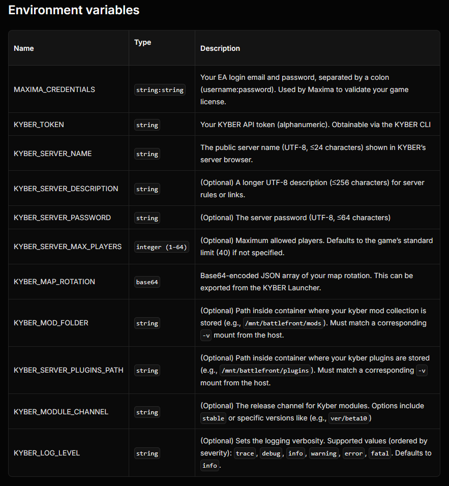
  </details>
<br>

### If you would like to control your KYBER servers with YAML configuration files, continue with `docker-compose`

<br>

To deploy the server we will use docker-compose. This will require a `docker-compose.yml` and a few `.env` files. We will use the `docker-compose.yml` as a reusable template, `secrets.env` to store tokens, and `<ServerName>.env` to store individual server settings and environment variables. See the [Dedicated-Server Config Docs](https://docs.kyber.gg/g/hosting/dedicated-servers/config) for a list of environment variables.

> [!TIP]
> **Where to Create These Files:**
>
> Create a dedicated folder for your server configuration (e.g., `C:\KyberServers` or `C:\Users\YourName\Documents\KyberServers`).
>
> Inside this folder, you'll create:
>
> - `docker-compose.yml` (universal template - one file for all servers)
> - `secrets.env` (your tokens/credentials - shared across servers)
> - Individual `.env` files for each server/gamemode (e.g., `hvvchaos.env`, `vanilla.env`)
>
> **Example folder structure:**
>
> ```plaintext
> C:\KyberServers\
> ├── docker-compose.yml
> ├── secrets.env
> ├── hvvchaos.env
> ├── vanilla.env
> └── logs\
>     ├── hvvchaos_server\
>     └── vanilla_server\
> ```
>
> **Important:** Use a text editor like Notepad, Notepad++, or VS Code to edit these files.

### A. docker-compose.yml file

- Create a file named `docker-compose.yml` in your project directory. It acts as a universal template. This file is used to start the server. Server logs will be output in the same directory as this file.

> [!NOTE]
> **What to Edit in docker-compose.yml:**
>
> For most users, you only need to change the volume names at the bottom of the file to match the volumes you created earlier.
>
> **Find this section at the bottom:**
>
> ```yaml
> volumes:
>   swbf2_data:  # ← Change this to your game files volume name
>     external: true
>   kyber_module_ver10:  # ← Change this to your Kyber module volume name
>     external: true
> ```
>
> **Leave these alone** (they pull from your `.env` files):
>
> ```yaml
>   kyber_mods:
>     external: true
>     name: ${MOD_VOLUME:-empty_data}
>   kyber_plugins:
>     external: true
>     name: ${PLUGIN_VOLUME:-empty_data}
> ```

```yaml
services:
  kyber-server:
    image: ghcr.io/armchairdevelopers/kyber-server:latest
    container_name: ${CONTAINER_NAME:-kyber_server}
    env_file:
      - secrets.env
    network_mode: "host"
    privileged: true
    command: ["--module-branch=ver/beta10", "--module-path=/root/.local/share/kyber/module"]
    environment:
      - KYBER_SERVER_NAME=${SERVER_NAME:-}
      - KYBER_SERVER_PASSWORD=${SERVER_PASSWORD:-}
      - KYBER_SERVER_MAX_PLAYERS=${SERVER_MAX_PLAYERS:-}
      - KYBER_MAP_ROTATION=${SERVER_MAP_ROTATION:-}
      - KYBER_SERVER_DESCRIPTION=${SERVER_DESCRIPTION:-}
      - KYBER_MODULE_CHANNEL=ver/beta10
      - KYBER_LOG_LEVEL=info
      # Short-form variables: Only passed to container if defined in .env
      - KYBER_MOD_FOLDER
      - KYBER_SERVER_PLUGINS_PATH
    volumes:
      - swbf2_data:/mnt/battlefront
      - kyber_mods:/mnt/battlefront/mods
      - kyber_plugins:/mnt/plugins
      # Mounting ver/10 Kyber.dll
      - kyber_module_ver10:/root/.local/share/kyber/module/
      # Mount the server logs (will output in same directory as docker-compose.yml /Logs/)
      - ./logs/${CONTAINER_NAME}:/root/.local/share/maxima/wine/prefix/drive_c/users/root/AppData/Roaming/ArmchairDevelopers/Kyber/Logs/
    restart: unless-stopped

volumes:
  swbf2_data:
    external: true
  kyber_module_ver10:
    external: true
  kyber_mods:
    external: true
    name: ${MOD_VOLUME:-empty_data}
  kyber_plugins:
    external: true
    name: ${PLUGIN_VOLUME:-empty_data}
```

### B Environment Files (.env)

- Create `secrets.env` in the same directory as your `docker-compose.yml`. This keeps your `<token>` and `<EA-Username>:<password>` separate and organized. We will load `secrets.env` automatically by listing it in our `docker-compose.yml`.

> [!IMPORTANT]
> **Editing Placeholder Values:**
>
> When filling in the `.env` files:
>
> 1. **Remove the `<` and `>` symbols** around placeholders
> 2. **Keep single quotes `'`** around values that contain spaces or special characters
> 3. **Replace `<token>` exactly** - no brackets left behind
>
> **Examples:**
>
> ```bash
> # WRONG - Don't do this:
> KYBER_TOKEN=<abc123xyz>
> MAXIMA_CREDENTIALS=email:password
> 
> # CORRECT - Do this:
> KYBER_TOKEN=abc123xyz
> MAXIMA_CREDENTIALS='email:password'
> ```
>
> **Why the quotes?**
>
> - `MAXIMA_CREDENTIALS='email:password'` - Quotes ensure the colon `:` isn't misinterpreted
> - `SERVER_NAME='My Cool Server'` - Quotes preserve spaces
> - `KYBER_TOKEN=abc123` - No quotes needed (no spaces or special characters)

Use `kyber_cli get_token` to get your KYBER_TOKEN value.

```yml
# secrets.env
# Secret Stuff
KYBER_TOKEN=abc123xyz456
MAXIMA_CREDENTIALS='your-email@example.com:YourPassword123'
```

> [!CAUTION]
> Remember: If your EA password has special characters (!, @, #, etc.), the server may fail to start. See the warning in [Prerequisites Section 3](#3-obtain-kyber-credentials).

- Now in the same directory as your `docker-compose.yml` we can create files for individual servers or gamemodes named `<ServerName>.env` (e.g., `hvvchaos.env`, `hvv6v6.env`, `coopBFPlusXL.env`. etc) This keeps your different game mode settings organized.

<details>

<summary>📸 <b>VIEW SCREENSHOT:</b> How to get your <code>base64-encoded‐map‐rotation</code> string (Click to expand) 🚨</summary>

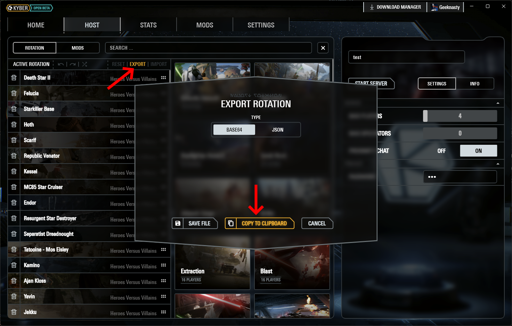

> **Explanation:** In the Kyber Launcher → **Host Tab** → **Export** → **Copy To Clipboard** the base64 string.  
> Paste it into your `.env` file wrapped in single quotes like this:  
> `SERVER_MAP_ROTATION='WyJzdXBfZ2Vvbm9zaXMiLCJzdXBfY2FzY2FkZSJd'`
</details>

<br>

**Example 1: Server with mods and plugins**

```yml
# hvvchaos.env
# Server Settings
COMPOSE_PROJECT_NAME=hvvchaos
CONTAINER_NAME=hvvchaos_server
SERVER_NAME='HVV Chaos Playground'
SERVER_MAX_PLAYERS=40
SERVER_DESCRIPTION='A longer UTF-8 description (≤256 characters) for server rules or links.'
SERVER_MAP_ROTATION='WyJzdXBfZ2Vvbm9zaXMiLCJzdXBfY2FzY2FkZSJd'

# Pick which Mods and Plugins you want (use your volume names from Step 2)
MOD_VOLUME=swbf2_mods_hvv_chaos
PLUGIN_VOLUME=swbf2_plugins_hvvplayground

# Copy these 2 lines into all .env files that use mods/plugins
KYBER_MOD_FOLDER=/mnt/battlefront/mods
KYBER_SERVER_PLUGINS_PATH=/mnt/plugins
```

**Example 2: Vanilla server (no mods or plugins)**

```yml
# vanilla.env
# Server Settings
COMPOSE_PROJECT_NAME=vanillahvv
CONTAINER_NAME=vanillahvv_server
SERVER_NAME='Vanilla HvV Server'
SERVER_MAX_PLAYERS=12
SERVER_DESCRIPTION='Vanilla HvV Map Rotation Test Server'
SERVER_MAP_ROTATION='WyJob3RoX2hlcm9fdnNfdmlsbGFpbiJd'
SERVER_PASSWORD=1234

# For vanilla servers with no mods/plugins, use empty_data
MOD_VOLUME=empty_data
PLUGIN_VOLUME=empty_data

# Optional: Comment these out or leave them - they're ignored when using empty_data
# KYBER_MOD_FOLDER=/mnt/battlefront/mods
# KYBER_SERVER_PLUGINS_PATH=/mnt/plugins
```

---
<br><br>

## Step 5: Launching & Verifying Your Server

### Starting Your Server

Run the server by specifying only the per-server/gamemode `.env` file (`secrets.env` loads automatically via `docker-compose.yml`):

1. Open PowerShell (or Command Prompt) in your server folder
2. Run the command for your server:

```powershell
docker-compose --env-file hvvchaos.env up -d
```

> [!NOTE]
> Use `-d` for detached (background) mode. Remove `-d` to see logs directly in the terminal.

**Checking Container Status:**

**Option 1: Docker Desktop** (Easiest for beginners)

1. Open Docker Desktop
2. Click "Containers" in the left sidebar
3. Find your container (e.g., `hvvchaos_server`)
4. Status should eventually show "Running" with a green dot

**Option 2: Command Line**

```powershell
docker ps
```

Look for your container name - it should show "Up" status.

<details>
<summary>📸 <b>VIEW SCREENSHOT:</b> <code>Docker Desktop Container Status</code> (Click to expand)</summary>

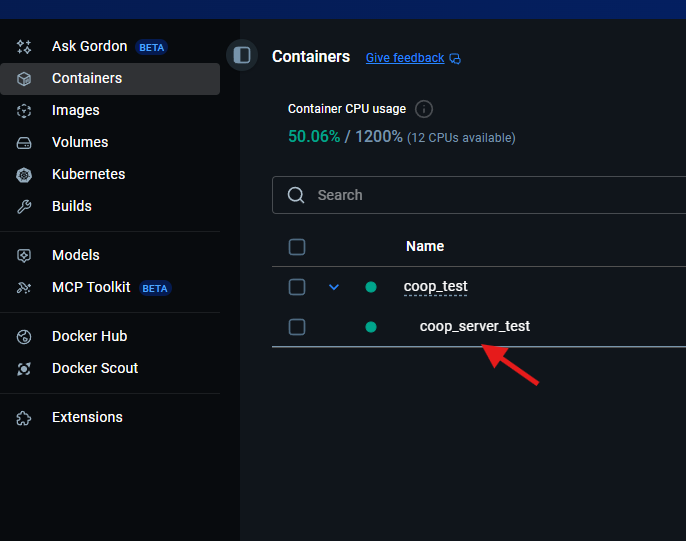
</details>

### Reading Logs

Logs help you verify the server started correctly and troubleshoot issues.

**Option 1: Docker Desktop** (Recommended for beginners)

1. Open Docker Desktop → Containers
2. Click on your container name
3. Click the "Logs" tab
4. Scroll to see recent activity

**Option 2: Log Files**
Check the `logs/` folder created next to your `docker-compose.yml` file:

```powershell
C:\KyberServers\logs\hvvchaos_server\
```

### Understanding Log Output

> [!TIP]
> **What Healthy Logs Look Like:**
>
> ✅ **Good signs:**
>
> - Logs show progression past `start_server` command
> - You see "Server started" or similar messages
> - Server appears in Kyber Launcher → Host tab → "Your Hosted Servers"
> - No repeated errors or crash loops
>
> ⚠️ **Benign warnings (safe to ignore):**
>
> - `DISPLAY` environment variable warnings
> - Wine display/headless errors
>
> ❌ **Problem signs:**
>
> - Stuck at or failing right after `start_server` command
> - Repeated crash/restart loops
> - Authentication errors: license request failed: `<?xml version="1.0" encoding="UTF-8" standalone="yes"?> <error code="INVALID_PASSWORD"/>`

<details>
<summary>📸 <b>VIEW SCREENSHOTS:</b> <code>Healthy logs vs. Problem logs</code> (Click to expand)</summary>

**Healthy startup logs:**
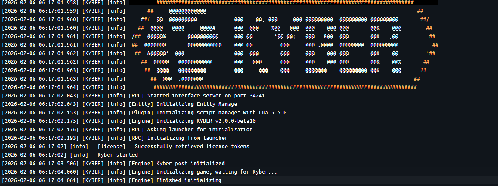

**Failed startup (stuck at start_server):**

</details>

### Verifying Server is Live

**In Kyber Launcher:**

1. Open Kyber Launcher
2. Go to the "Host" tab
3. Look in "Your Hosted Servers" section
4. Your server should appear in the list

<details>
<summary>📸 <b>VIEW SCREENSHOT:</b> <code>Server appears in Kyber Launcher</code> (Click to expand)</summary>

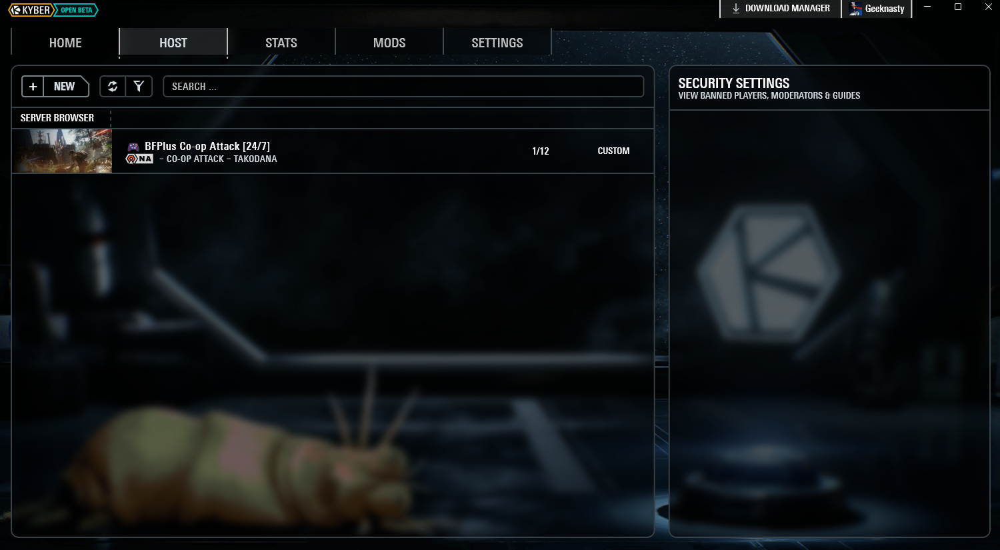
</details>

### Common Startup Issues & Solutions

> [!WARNING]
> **Server fails or hangs at `start_server` command:**
>
>
> This is the most common failure point. Usually caused by:
>
> 1. **EA password with special characters** → See [Prerequisites Section 3](#3-obtain-kyber-credentials)
> 2. **Incorrect KYBER_TOKEN** → Regenerate with `kyber_cli get_token` and copy exactly
> 3. **Typo in credentials** → Double-check `secrets.env` for copy/paste errors
> 4. **Wrong volume names** → Verify volume names in `docker-compose.yml` match your created volumes
>
> **How to fix:**
>
> 1. Stop the server: `docker compose down`
> 2. Fix the issue in your `.env` files
> 3. Restart: `docker-compose --env-file yourserver.env up -d`

### Stopping Your Server

**Use Docker Desktop** Container tab

or

```powershell
# Stop and remove container
docker compose --env-file yourserver.env down

# Stop but keep container (can restart later)
docker compose --env-file yourserver.env stop
```

### Running Multiple Servers

To run different gamemodes/servers simultaneously:

```powershell

docker-compose --env-file hvvchaos.env up -d
  
docker-compose --env-file vanilla.env up -d

```

Each server will have its own container, logs folder, and appear separately in the Kyber Launcher.

---

<br><br>

## Quick Start Recommendation

> [!TIP]
> **For your first server, start simple:**
>
> 1. Create a vanilla server (no mods/plugins) using `empty_data` volumes
> 2. Use a simple 2-3 map rotation
> 3. Verify it works and appears in Kyber Launcher
> 4. Once successful, create additional servers with mods/plugins
>
> This isolates any configuration issues and builds your confidence!

---

## Using the Example Files

- The `.example` files in this repository serve as templates.
- Copy them and remove the `.example` suffix:

```bash
  cp secrets.env.example secrets.env
  cp vanilla.env.example vanilla.env
```

- Fill in your actual values (remember to remove `< >` brackets!)
- The `.gitignore` file prevents committing your real `.env` files with credentials.

---

## Additional Resources

- [Official KYBER Documentation](https://docs.kyber.gg/)
- [KYBER Discord Community](https://discord.gg/kyber) - Get help from the community
- [Docker Desktop Documentation](https://docs.docker.com/desktop/)
- [Report issues with this guide](https://github.com/Geeknasty/KYBER-Windows-Hosting-Guide/issues)

---

## License

This project is licensed under the MIT License - see the [LICENSE](LICENSE) file for details.
